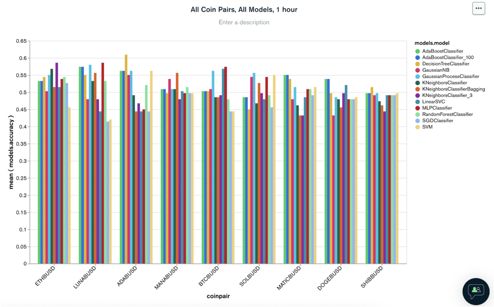

# getcryptorich.com

### This tool compares the accuracy and hypothetical returns of multiple machine-learning model types and time periods for a chosen crypto pair to determine which will yield the best results, with the intent of informing and optimizing crypto trading algorithms.

The main research question we wanted to explore was what is the optimal machine learning model and trading timeframe to use for a chosen coin pair when building a crypto trading bot.

- Disclaimer: the content contained in this project is for informational purposes only and the user should not construe any such information as investment, financial, tax, legal or other advise. Any ideas or strategies discussed herein should not be undertaken by any individual without prior consultation with a financial professional for the purpose of assessing whether the ideas or strategies that are discussed are suitable to you based on your own personal financial objectives, needs and risk tolerance.

---

## Technologies

This project leverages python 3.9 and Google Colab was used to run all analysis.

We used the following tools to gather information:

- [Binance API](https://www.binance.com/en/support/faq/c-6?navId=6) - this method allows you to connect to the Binance servers via Python to automate your trading and pull live financial data.
- [MongoDB](https://www.mongodb.com/) - this is a document database used for high volume data storage.

---

## Installation Guide

Before running the application first import the following libraries and dependencies.

```python
!pip install pandas
!pip install numpy
!pip install pymongo==4.0.0
!pip install dnspython

import pandas as pd
import numpy as np
import hvplot.pandas
import os
import pickle
from pathlib import Path
from datetime import datetime
from pymongo import MongoClient
from pprint import pprint
from dotenv import load_dotenv
from pandas.tseries.offsets import DateOffset
from finta import TA

For training and testing data:
from sklearn.preprocessing import StandardScaler
from imblearn.over_sampling import RandomOverSampler

Import the classifier Models
from sklearn.svm import SVC
from sklearn.tree import DecisionTreeClassifier
from sklearn.neural_network import MLPClassifier
from sklearn.naive_bayes import GaussianNB
from sklearn.gaussian_process import GaussianProcessClassifier
from sklearn.neighbors import KNeighborsClassifier
from sklearn.gaussian_process.kernels import RBF
from sklearn.ensemble import RandomForestClassifier, AdaBoostClassifier, BaggingClassifier
from sklearn.discriminant_analysis import QuadraticDiscriminantAnalysis

Import Classification Report
from sklearn.metrics import classification_report

```

---

## Data Preparation

The `utils` folder contains the nine functions utilized in the file `model_selector.ipynb`, which runs the selected Finta indicators and the SKLearn Algorithms to show the optimal model or each timeframe indicated per cryptocurrency coin pair.

**9 Crypto coin pairs**:
ADABUSD, SOLBUSD, DOGEBUSD, MATICBUSD, MANABUSD, SHIBBUSD, ETHBUSD, LUNABUSD, BTCBUSD

**4 Timeframes**: 30m, 1h, 4h, 1d

**27 Indicators tested**:
DMI+, DMI-, MOBO Upper, MOBO Middle, MOBO Lower, SMA Fast, SMA Medium, SMA Slow, SSMA, EMA20, EMA50, EMA200, DEMA, TRIMA, WMA, RSI, STOCHRSI, MACD, VW MACD, KAMA, ZLEMA, PZO, MFI, SQZM, Fear and Greed, Google Trends, Volume

**12 Models**:
RandomForestClassifier, SVM, SVM linear, DecisionTreeClassifier, AdaBoostClassifier, AdaBoostClassifier 5000, MLPClassifier, GaussiaNB, GaussianProcessClassifier, KNeighborsClassifier, KNeighborsClassifier_3, KNeighborsClassifierBagging

The following are three additional files in our package:

- populate_database.ipynb: this populates the database with selected coin pairs and Fear and Greed Index, uses an already set up Mongo Database to store the data.
  **Suggested to run only if we need new data loaded into the db**

- update_database.ipynb: this updates the database with the configured data to the last minute.
  **Suggested to run only if we need up-to-date data loaded into the db, this update will change the data and therefore might show different results in the predictions every time an algorithm is run**

- colab-model_selector.ipynb: this is the collective file used to run the codes in Google Colab.

---

## Results

The combination of the following 13 indicators consistently produced the highest model accuracy for each of the chosen coin pairs and models:
SMA Fast, SMA Slow, SSMA, EMA20, EMA50, DEMA, TEMA, TRIMA, WMA, STOCHRSI, F&G, Google Trends, Volume

Below is a sample chart displayed on MongoDB:



Below is a sample summary of the best model and timeframe to use per coin we chose:

- ADABUSD

  - Model: DecisionTreeClassifier
  - Timeframe: 1h

- BTCBUSD

  - Model: AdaBoostClassifier or AdaBoostClassifier_100
  - Timeframe: 1d

- ETHBUSD

  - Model: GaussianNB
  - Timeframe: 1d

- SOLBUSD

  - Model: DecisionTreeClassifier
  - Timeframe: 1d

- LUNABUSD

  - Model: MLPClassifier
  - Timeframe: 1h

- DOGEBUSD

  - Model: DecisionTreeClassifier, KNeighborsClassifier_3, GausianNB
  - Timeframe: 30min, 1d, 1d

- MATICBUSD

  - Model: RandomForestClassifier
  - Timeframe: 1d

- MANABUSD

  - Model: KNeighborsClassifier_3
  - Timeframe: 4h

---

## Conclusion

For users to view a summary of all the coin pairs, they can visit [this website](https://project-2-liard.vercel.app/) to get an understanding of which model and timeframe to select for the coin they wish to trade for optimal profits.

Although we have identified certain indicators, models, and timeframes to be optimal for trading certain coins, it is still important to also look at the rist metrics associated with each coin.

This site we created also includes financial risk metrics, such as annual volatility, annualized return, cumulative returns, the Sharpe ratio, and the Sortino ratio for the user to reference and make the best financial decisions.

---

## Contributors

Gabriel Alcivar - galcivar@galgomedia.com

Nico Cortese - nicolasacortese@gmail.com

Nadirah Durr - nadirahcodes@gmail.com

Yu Sun - sunyu92289@gmail.com

Heeje Yoo - heeje.yoo@pm.me

---

## License

The MIT License (MIT)
Copyright © 2022 <copyright holders>

Permission is hereby granted, free of charge, to any person obtaining a copy of this software and associated documentation files (the “Software”), to deal in the Software without restriction, including without limitation the rights to use, copy, modify, merge, publish, distribute, sublicense, and/or sell copies of the Software, and to permit persons to whom the Software is furnished to do so, subject to the following conditions:

The above copyright notice and this permission notice shall be included in all copies or substantial portions of the Software.

THE SOFTWARE IS PROVIDED “AS IS”, WITHOUT WARRANTY OF ANY KIND, EXPRESS OR IMPLIED, INCLUDING BUT NOT LIMITED TO THE WARRANTIES OF MERCHANTABILITY, FITNESS FOR A PARTICULAR PURPOSE AND NONINFRINGEMENT. IN NO EVENT SHALL THE AUTHORS OR COPYRIGHT HOLDERS BE LIABLE FOR ANY CLAIM, DAMAGES OR OTHER LIABILITY, WHETHER IN AN ACTION OF CONTRACT, TORT OR OTHERWISE, ARISING FROM, OUT OF OR IN CONNECTION WITH THE SOFTWARE OR THE USE OR OTHER DEALINGS IN THE SOFTWARE.
